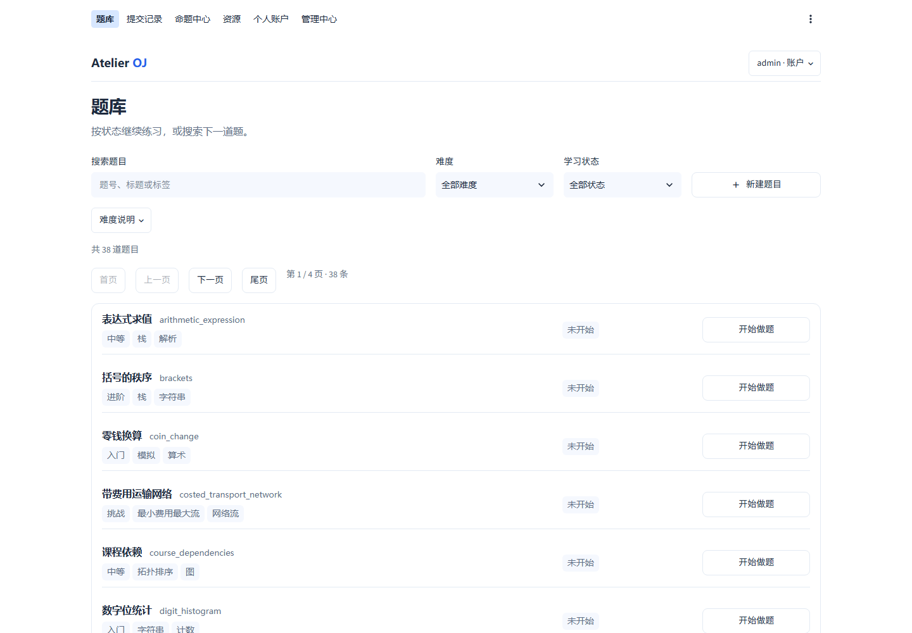
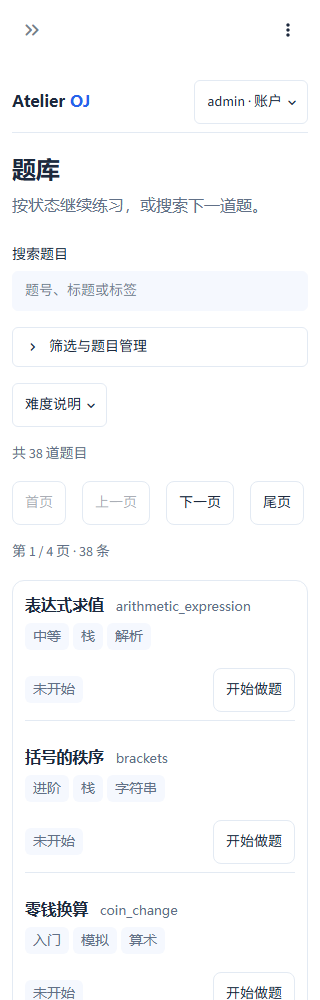
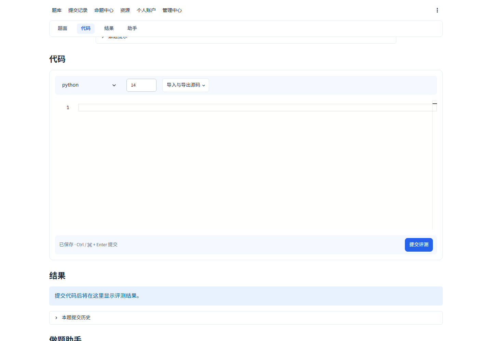

# 在线评测系统实验报告

Atelier OJ · 程序设计训练（Python）实验二 · 2026-09-10

| 项目 | 内容 |
| --- | --- |
| 姓名 | ____________________ |
| 学号 | ____________________ |
| 班级 | ____________________ |
| 仓库 | `jasonpiggg/Online-Judge-System` |
| 后端 | Python 3.12、FastAPI、Pydantic、aiosqlite |
| 默认前端 | Streamlit 1.63 |
| 可选前端 | React 19、TypeScript 6、Vite 8 |
| 完整评测环境 | Ubuntu / WSL2、Python 3.12、GCC 9+、C++14 |

本报告从当前最新版代码重新编写，描述实际实现和已执行的验收，不沿用旧版本结论。
课程要求以官方的 [实验内容](https://dbg-course.github.io/python-docs/oj/)、
[API 文档](https://dbg-course.github.io/python-docs/oj/api/)和
[评分标准](https://dbg-course.github.io/python-docs/oj/requirements/)为准。

最终 PDF 固定放置在：`output/pdf/atelier-oj-experiment-report.pdf`。
提交前应补全个人信息，并由 `scripts/build_report.py` 从本 Markdown 生成 PDF。

## 1. 系统目标与功能概览

Atelier OJ 是面向程序设计课程的异步在线评测系统。它覆盖题目管理、Python/C++14
评测、提交管理、用户与角色、测试点日志、访问审计、Streamlit 前端，以及 AI 智能命题
R1–R4。系统遵循统一的 REST 响应结构：

`{"code": HTTP状态码, "msg": "...", "data": ...}`

所有课程 API endpoint 均使用 `async def`。提交接口先持久化 `pending` 状态，再由后台
`asyncio.Task` 完成编译、逐点评测和结果保存；AI 命题也采用可观察、可取消的后台任务。

| 评分模块 | 当前实现 |
| --- | --- |
| Step 1 题目管理 | JSON 加载校验、完整 CRUD、默认字段、原子写入、权限与异常 |
| Step 2 评测控制 | Python/C++14、动态语言、AC/WA/TLE/MLE/RE/CE/UNK、时间与内存限制 |
| Step 3 评测管理 | pending、详情、组合筛选、分页、权限、限频与原 ID 重测 |
| Step 4 用户管理 | 注册、登录/退出、初始管理员、bcrypt、Session、角色和用户统计 |
| Step 5 日志审计 | 得分与测试点日志裁剪、公开策略、成功/拒绝访问审计 |
| Step 6 前端交互 | Streamlit 用户、题目、提交与管理页面，全部经 REST API 对接 |
| Advance AI 命题 | 模型配置、流式进度、真实取消、Token/费用、草稿与本地质量门禁 |

## 2. 系统架构与技术选型

### 2.1 总体架构

```text
Browser
  │
  ├── Streamlit（默认，课程验收入口）
  └── React + TypeScript（可选）
             │ REST / HttpOnly Session Cookie
             ▼
         FastAPI async routers
             │
             ├── SQLite：用户、Session、语言、提交、日志、AI 任务与草稿
             ├── JSON：每题一个配置文件，原子写入
             ├── SubmissionManager：异步评测 Task
             └── oj.ai：异步模型任务、计价、取消与质量验证
                         │
                         └── 本地 judge / 外部模型 provider
```

FastAPI 适合用 `async def` 组织 I/O 密集型 API；`aiosqlite` 避免同步数据库访问阻塞事件环。
Pydantic 同时承担 API 输入、题目文件和模型输出的严格 schema 校验。题目使用独立 JSON，
便于人工检查和版本控制；事务、审计和关联查询使用 SQLite。Streamlit 满足课程指定前端技术，
React 入口用于更复杂的浏览器交互，但不会替代默认验收入口。

### 2.2 模块划分

`src/oj/routers/` 只处理 HTTP contract、鉴权与响应裁剪；`auth.py`、`security.py`、
`database.py`、`problem_store.py`、`languages.py`、`judge.py`、`submissions.py` 分别负责
核心领域。AI 代码集中在 `src/oj/ai/`，按 provider、policy、prompt、局部编辑、展示检查和
持久化工作流拆分，避免进阶模块继续挤在后端根目录。详细依赖方向见
[架构说明](architecture.md)。

前端按业务场景拆为账户、题库、工作区、记录、命题和管理页面；统一客户端集中处理 Cookie、
HTTP 状态码、`code/msg/data` envelope 和可操作错误提示。页面不会直接读写后端数据库或题目文件。

## 3. 基础模块实现

### 3.1 Step 1：题目管理

题目模型校验 `id`、标题、题面、输入输出说明、样例、约束和测试点等必选字段，并为提示、
来源、标签、时限、内存、作者和难度提供默认值。题号只允许 1–64 位字母、数字、下划线和
连字符，阻止路径穿越。启动时加载种子题目与已有 JSON；任何损坏配置都会在初始化时暴露，
不会被静默忽略。

新增、详情、列表、编辑和删除接口均已实现。新增防止重复 ID；编辑要求路径 ID 与请求体 ID
一致并重新校验完整配置；删除只允许管理员。写入过程在同目录创建临时文件，刷新、`fsync`
后用原子替换提交，失败时清理临时文件。同步文件操作通过 `asyncio.to_thread` 卸载，避免阻塞
FastAPI event loop。

### 3.2 Step 2：评测控制

系统启动注册 Python 与 C++14。动态语言包含扩展名、编译命令、运行命令及默认资源限制。
命令先解析为 argv，不经过 shell；仅允许白名单 executable 和 `{src}`、`{exe}` 占位符，
拒绝重定向、管道、串联命令及未知占位符。

每次评测使用独立临时目录。C++ 只编译一次，再逐测试点执行；Python 直接解释执行。
stdout、stderr 同时异步读取并设置 1 MB 上限，避免子进程因管道塞满死锁。输出比较统一换行，
忽略每行尾空白和文件末尾多余换行，其余字符严格匹配。每个 AC 测试点计 10 分。

Linux 下设置地址空间、core dump、输出文件、进程数量、墙钟时间与进程组回收，同时用 psutil
监控整棵进程树 RSS。结果覆盖 AC、WA、TLE、MLE、RE、CE 和 UNK；编译信息、运行阶段信息和
任务级错误分别保存。Windows 可用于界面开发，但正式资源限制结论以 Ubuntu/WSL2 为准。

### 3.3 Step 3：评测管理

提交写库后立即返回 `submission_id` 与 `pending`，后台任务完成后变为 `success`；只有评测
基础设施异常才记为 `error`。服务重启会恢复 pending 提交。每用户每题一分钟最多三次提交，
检查与写入共用异步锁，避免并发请求同时绕过限制。

列表支持用户、题目、状态、分页及扩展结果筛选。普通用户只能读取自己的记录，管理员可按
用户或题目查看；列表仅返回摘要。详情返回状态、总分、编译、运行和错误信息，且只允许本人或
管理员。管理员重新评测会取消旧 Task、清理旧测试点、在原 `submission_id` 上重置为 pending
并重新调度。

### 3.4 Step 4：用户管理

首次启动幂等创建课程指定的 `admin / admintestpassword`。注册验证用户名长度、字符和唯一性，
密码至少 6 字符且最多 72 个 UTF-8 字节，使用 bcrypt 哈希。登录使用恒定的 dummy hash 降低
用户枚举时序差异，成功后生成高熵 Session ID；Cookie 设置 HttpOnly、SameSite、过期时间，
HTTPS 部署可开启 Secure。退出会删除服务端 Session。

每个受保护请求都从数据库重新读取用户角色，所以账号被禁用后，已有 Session 也立即失效为
403。本人或管理员可看用户资料；管理员可分页查询用户并修改 `user/admin/banned` 角色。
系统阻止唯一管理员被降权或禁用，并在同一事务中记录角色变更。用户统计按提交次数计数，
通过题数按不同题号去重。

### 3.5 Step 5：评测日志与审计

测试点日志与提交关联，保存 case ID、verdict、时间、峰值内存和内部裁剪诊断。课程接口只返回
允许公开的字段：私有题目中提交者只能查看 `score/counts`，其他普通用户返回 403；公开后所有
已登录用户可查看逐点 `details`；管理员始终可见。公开测试点不会开放他人的源码、编译信息或
提交详情。

对存在提交的日志读取会记录 `view_logs`、访问者、题号、日期和 200/403 状态。未登录、参数
错误或提交不存在不产生审计记录。管理员可按用户、题目和分页查询访问日志。日志可见性只能由
管理员修改，普通题目编辑不能绕过该限制。

### 3.6 Step 6：前端交互

Streamlit 默认入口覆盖注册、登录、退出、本人信息、密码修改和管理员用户管理；题目列表、
详情、新增、编辑与删除；代码提交、提交记录、提交详情、评测状态、编译/运行/错误信息；语言
管理、日志公开与审计。会话由后端 Cookie 判定，页面隐藏按钮不是权限依据。

工作区提供题面、Monaco 编辑器、语言切换、代码草稿、提交结果和 AI 助手。表单提交前做即时
校验，但最终仍以后端 schema、状态码和权限判断为准。错误组件展示具体原因和建议；危险操作有
二次确认。页面已覆盖 1440、1024、390 和 320 px，支持键盘 focus、响应式折叠及无横向溢出。

## 4. Advance：AI 智能命题

### 4.1 R1 出题交互界面

命题中心可输入知识点、难度和补充约束，或选择已有题目/草稿进行修改。任务显示阶段、进度、
结果和失败原因。生成结果先进入版本化草稿，可继续人工编辑、局部修改、验证和显式发布，
不会以压缩包形式与题目管理割裂。界面明确标注 AI 生成内容需要人工审阅。

### 4.2 R2 自定义模型配置

用户可配置 provider URL、model、API key、输入/输出价格、计价单位和币种。配置会实际生成
后续请求；不在代码中固定 provider、模型或密钥。GET 只返回 `api_key_configured` 等非敏感
信息。密钥使用 Fernet 加密持久化，错误和日志不会回显密钥。默认要求 HTTPS 与公网目标，
禁用重定向和环境代理，并固定校验后的 DNS 地址以缩小 SSRF/DNS rebinding 风险。

### 4.3 R3 实时进度与中断

后台任务持续保存分析、生成、复审、本地验证和完成阶段；前端通过轮询/SSE 展示真实状态，
不是纯动画。取消接口会取消后台 Task、关闭流式 HTTP 请求，并传播到本地 runner，阻止任务
继续执行或写入完成结果。已结束任务再次取消返回 409。进程重启时遗留任务标记失败，不自动
重放付费请求。

### 4.4 R4 Token 与费用

任务分别记录输入、输出、缓存命中和总 Token。优先使用 provider 返回的 usage；接口不提供
完整用量时，以已观察内容进行估算并标注限制。费用按各阶段价格快照计算：

`(非缓存输入 × 输入价 + 缓存输入 × 缓存价 + 输出 × 输出价) / price_unit`

页面显示 Token、费用、币种、计价单位、配置来源和“估算/服务商报告”依据。取消和失败仍保留
已观察用量，历史记录不受之后价格修改影响。

### 4.5 题目合理性、测试有效性与易用性

完整生成要求题面、样例、测试点、Python 参考解、独立暴力解、受限生成器、覆盖说明和典型
错误算法。模型输出经 JSON/schema 校验和题面展示检查；参考解必须通过全部样例与测试点。
独立 oracle 与参考解在 20–100 组生成输入上对拍；典型错误解必须被至少一个 WA/TLE/MLE
测试点区分，CE、RE、UNK 不能冒充有效卡错。mutation score、失败诊断和覆盖说明会显示给
命题者。只有质量门禁通过的草稿才进入 ready，发布仍需人工确认。

## 5. 关键难点与解决方案

| 难点 | 解决方案 |
| --- | --- |
| FastAPI 默认先返回 422 | 受保护路由先鉴权；统一 validation handler 转为 400；HTTP 与 JSON code 同步 |
| 异步接口中存在阻塞操作 | 文件、bcrypt、DNS 用 `asyncio.to_thread`；数据库与子进程使用异步 API |
| 运行超时后孙进程仍占用管道 | 每次任务建立进程组；超时、取消、输出超限时杀整个组并继续排空管道 |
| 并发提交绕过一分钟三次限制 | 同一入口锁内完成计数、资源检查、插入和任务调度 |
| JSON 与 SQLite 跨存储一致性 | 固定锁顺序、SQLite 事务、JSON 原子替换；失败时回滚/补偿恢复 |
| 公开日志与私有提交边界混淆 | 评测详情、测试点日志和前端 metadata 使用同一可见性投影 |
| AI 任务取消只停界面 | 取消信号贯穿 HTTP 流、后台 Task 和本地验证子进程 |
| AI 输出形式正确但题目无效 | schema、参考解实跑、oracle 对拍、错误解卡错和 mutation score 多层门禁 |

## 6. 验收结果与边界测试

本轮在 Windows / Python 3.14 项目虚拟环境完成静态检查和非 Linux 回归。Linux 专用 runner
用例在本地按 marker 跳过，由 Ubuntu GitHub Actions 执行。最终数字以本任务合并提交对应的
CI 记录为准。

| 检查 | 结果 |
| --- | --- |
| Ruff | 通过 |
| mypy strict | 通过 |
| pytest | 357 passed，10 Linux-only skipped |
| 后端覆盖率 | 行 95% 以上，分支 88% 以上，超过 90% / 85% 门槛 |
| Vitest | 75 passed |
| ESLint / TypeScript | 通过 |
| Python 依赖审计 | 0 个已知漏洞 |
| Node runtime 依赖审计 | 0 个已知漏洞 |
| Git 大文件检查 | 最大业务资产约 1.2 MiB，无异常大文件 |
| Playwright | React 与 Streamlit 全流程、桌面/移动端验收通过 |

边界测试覆盖：损坏 JSON、字段缺失、重复题号、路径穿越、越权、Session 过期、banned 用户、
超长 UTF-8 密码、非法分页组合、超大页码、并发限频、公开/私有日志、重测覆盖、reset 取消、
Python/C++ 编译或运行错误、超时、超内存、输出洪泛、子进程回收、AI 坏 JSON、断流、超时、
取消、密钥隐藏、私网 provider 拒绝、Token 估算及草稿版本冲突。

当前明确边界：Windows 原生运行不等价于 Linux `rlimit`；课程 runner 不是生产级恶意代码
沙箱；真实模型的题目质量依赖所选 provider，自动门禁降低风险但不能替代教师审阅；未获得
用户对付费模型调用的授权时，本轮不重复消耗真实 Token。

## 7. 成果展示








## 8. 代码规范与 Git 实践

后端采用严格类型、集中 schema、清晰包边界和解释“为什么”的关键注释；前端采用共享组件与
CSS token。CI 在 Ubuntu 上执行 Ruff、mypy、pytest/coverage、pip-audit、ESLint、TypeScript、
Vitest、构建和 Playwright。依赖由 `uv.lock` 与 `package-lock.json` 固定；`.env`、数据库、
Session、日志、coverage、构建产物和测试产物均被忽略。仓库功能提交使用 `codex/` 分支与
Conventional Commits，经 PR、自动代码审查、CI 和普通 merge commit 合入 `main`。

版本库中的最大文件为前端压缩组件资产，约 1.2 MiB；报告 PDF、截图和字体均控制在合理大小，
不存在把虚拟环境、数据库、日志或大体积构建目录提交到 Git 的情况。

## 9. AI 使用说明

本项目允许 Vibe Coding。用户负责确定需求、交互方向、验收优先级和最终提交；Codex 用于课程
文档检索、代码与测试实现、静态检查、浏览器验收、GitHub 流程和报告整理。AI 辅助比例较高，
但项目没有可靠的逐行作者标注，因此不虚构精确百分比。所有建议都通过测试、差异审查与实际
界面检查验证；付费模型检查不会在未获明确授权时执行。

采用的工作流为：读取最新课程原文 → 建立逐条验收矩阵 → 检查实现与权限边界 → 增加失败回归
→ 修正代码 → 静态/单元/集成/浏览器测试 → 自动代码审查与 CI → 更新报告。使用 AI 不替代对
异步任务、权限、资源限制、密钥保护和测试边界的理解。

## 10. 总结与改进建议

本实验把单一 CRUD 服务扩展为包含异步任务、受限子进程、权限审计、前端状态和大模型工作流的
完整系统。最重要的收获是：异步并不只是把路由写成 `async def`，还必须识别阻塞边界、明确
Task 所有权、传播取消并处理持久化一致性；安全也不能只靠前端隐藏入口，而要落实到每个后端
查询和输出字段。

后续若面向非可信公网用户，优先引入独立 worker、容器/VM、cgroup、seccomp、网络隔离、队列
与配额，而不是继续堆叠界面功能。AI 命题应建立固定课程知识点数据集、真实模型盲测和教师评分
样本，用可重复质量数据替代单次展示印象。
