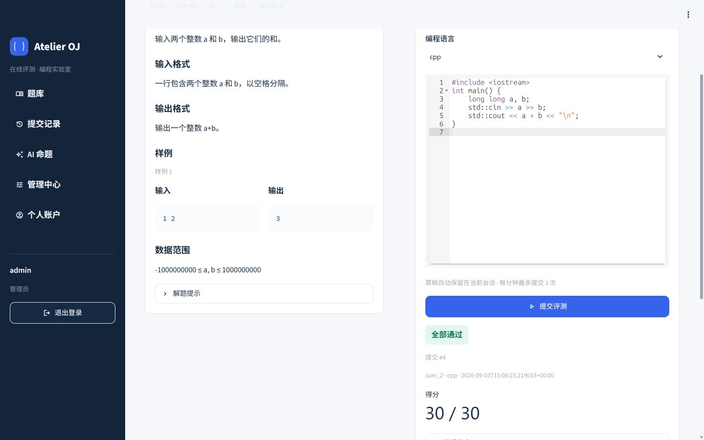
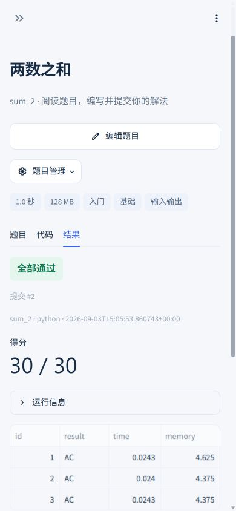
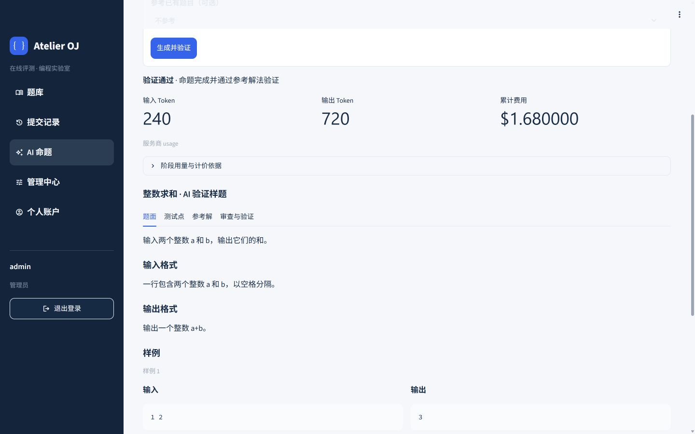

# 在线评测系统实验报告

Atelier OJ · 实验二 · v1.1.0

| 项目 | 内容 |
| --- | --- |
| 姓名 | ____________________ |
| 学号 | ____________________ |
| 班级 | ____________________ |
| GitHub | jasonpiggg/Online-Judge-System |
| 完整评测环境 | Ubuntu / WSL2，Python 3.12.3，系统 g++，C++14 |
| 界面开发环境 | Windows，Streamlit 1.63.0，FastAPI |
| 报告日期 | 2026-09-04 |

本报告描述实际代码和已执行的测试，不代表助教最终评分。课程说明以 [2026-python 分支](https://github.com/dbg-course/python-docs/tree/2026-python/docs/oj) 为准。最终提交仍需遵守课程指定仓库、网络学堂和线下验收要求。

当前自动测试、Linux 真实 runner、普通用户和管理员浏览器链路均已验证。三档响应式尺寸及危险操作二次确认已复验；外部真实模型供应商因没有用户密钥而明确列为未验收项，不用 mock 结果替代该结论。

## 1. 目标、架构与评分点

系统保留课程要求的 Python 技术栈。Streamlit 只负责交互，通过 requests.Session 调用 REST API；FastAPI 使用 async def 路由，依赖注入完成鉴权，后台 asyncio Task 负责评测和命题。阻塞文件操作、密码哈希、DNS 查询使用线程卸载，SQLite 通过 aiosqlite 访问。

| 模块 | 分值 | 实现及证据 |
| --- | --- | --- |
| Step 1 | 5 | 独立 JSON、加载校验、CRUD、原子替换；test_problems、test_core_edges |
| Step 2 | 5 | Python/C++14、语言模板注册、逐点评测及资源限制；test_linux_judge、test_judge_regressions |
| Step 3 | 5 | pending、组合查询、分页、本人/管理员权限、重测；test_submissions、test_api_edges |
| Step 4 | 5 | bcrypt、Session、角色、统计、独立角色审计；test_auth_users、test_role_audit |
| Step 5 | 5 | 私有/公开测试点日志、200/403 访问审计；test_logs_reset、test_api_edges |
| Step 6 | 5 | 账户、题库、同屏做题、可视化编辑器、管理中心；AppTest 及三尺寸真实浏览器验收 |
| AI R1-R4 | 4 | 可读工作台、自定义加密配置、进度与取消、Token/费用；真实 HTTP/SSE mock 自动测试 |
| AI 质量与易用性 | 6 | 二次批判改进、唯一测试输入、参考解与错误解验证、编辑器集成；真实供应商质量未验收 |
| 代码规范 | 5 | 分层结构、Ruff/mypy、uv.lock、CI、分阶段真实 PR；不以自动检查代替代码理解 |
| 实验报告 | 5 | 架构、难点、测试证据、真实截图、AI 使用说明与改进建议 |

目录分工：src/oj/routers 保存业务接口；auth、security、database、problem_store、judge、submissions、ai_authoring、ai_transport 分别负责领域功能。frontend 下按账户、题库、编辑器、记录、管理、AI 页面拆分；data/problem_seeds 保存可恢复的演示题。

## 2. 数据、权限与接口

### 混合存储与无损迁移

每题一个 JSON 文件。安全题号只允许字母、数字、下划线和连字符；保存前经 Pydantic 校验。同目录临时文件写入、fsync、原子替换及异步锁保证写入完整性。输入、输出、代码和密码不自动 strip，保留有意义的空白。

SQLite 表包括 users、sessions、languages、submissions、submission_cases、access_logs、role_change_logs、ai_configs、ai_tasks。启用外键、WAL 和查询索引。PRAGMA user_version 管理版本：旧库升级前使用 SQLite backup 生成 pre-vN 备份，迁移幂等，不通过 reset 升级。版本 1 增加 AI 阶段/用量依据，版本 2 增加角色审计。

题目限制内部允许未设置，JSON 中保持省略。评测逐项使用“题目显式值、语言值、系统 3 秒/128 MB”的顺序。课程 GET 接口仍展示默认值，额外 limit_inheritance 字段供编辑器区分继承与显式配置，不猜测旧数据的原始意图。

### 身份与权限

启动保留指定管理员 admin / admintestpassword。密码使用 bcrypt，随机 Session ID 存在服务端数据库中；登录轮换，退出删除，Cookie 设置 HttpOnly、SameSite 和有效期。每次访问重新检查用户角色，因此已有会话被禁用后也返回 403。

普通用户可添加/编辑题目、创建语言、提交代码；管理员拥有删除题目、修改角色、重测、日志公开、全站审计和重置权限。通用题目编辑也不能绕过日志公开权限。角色修改与操作审计在同一事务内提交，不混入课程要求 action=view_logs 的访问日志。前端在同一账号重新登录时保留草稿；切换账号时清除工作区、题目编辑器和 AI 瞬态状态，避免同一浏览器会话跨账号展示源码或命题结果。

响应统一为 code、msg、data，实际 HTTP 状态码与 code 一致。校验错误由 422 转为 400；对可识别的越权范围，在分页校验前返回 403。未登录、无权限、参数错误、限频、冲突、不存在和内部异常分别覆盖对应优先级测试。

### 查询与审计

提交列表默认遵守一级条件不可全空、page/page_size 组合语义，只返回列表摘要。前端管理员通过可选 all_users 扩展查询全站；include_metadata 仅增加展示所需元数据，源码只出现在有权限的详情中。用户统计按提交计数，已通过题目按题号去重。

本人和管理员可以查看逐点日志；题目公开后其他登录用户也能查看日志，但仍不能读取私有提交概要。存在且有效的日志访问分别记录 200/403；未登录、非法参数或不存在的记录不写审计。API 默认不返回内部异常、密钥或服务端临时路径。

## 3. 异步评测与一致性

提交先落库为 pending，再启动后台 Task，接口不等待判题结束。重启恢复 pending 提交；重新评测先取消旧任务，再清理并覆盖同一 submission_id。正常评测完成是 success，不等于全部 AC；基础设施错误才是 error。界面分别显示“全部通过”“评测完成 · 未全部通过”和“评测服务异常”。

默认 Python 直接执行，C++14 经 g++ 编译。命令模板扩展为 argv，不使用 shell；只接受安全可执行程序和 src/exe 占位符。每次评测使用独立临时目录作为工作目录、最小环境、进程组。Linux 以 RLIMIT_AS、RLIMIT_FSIZE、禁用 core dump、墙钟超时、进程树 RSS 监控及子进程数量上限约束运行。

stdout/stderr 各并发分块读取，分别最多保留 1 MB；超限立即终止整个进程组并返回 UNK。编译同样有界读取，超时或洪泛返回 CE。取消和超时会等待管道排空、回收进程并清理临时目录。编译和运行诊断中的临时工作路径被替换为 workspace 标记。

输出比较忽略行末空白及最终多余换行，其他字符严格匹配。每个 AC 测试点 10 分，counts 为测试点数量乘 10。各点独立记录 verdict、耗时、内存和裁剪后的诊断。

测试发现原有“查询次数后再插入”的实现可被 6 个并发请求同时绕过。现以单 worker 的 intake_lock 包住限频检查和创建，实测恰好 3 个成功、3 个 429。reset 先取消 AI 和评测任务，再清理数据，避免旧任务在 ID 重用后写回新记录。

这些限制是课程级防护，不是生产级沙箱。任意代码仍可能访问同一用户权限下的文件或网络；默认只能在可信本机、单 worker、localhost 环境运行，不能直接公开部署。

## 4. AI 命题与安全

### 生成、批判和本地验证

用户输入知识点、难度、约束和可选参考题。第一阶段真实流式调用生成完整题目，第二阶段再次真实调用，批判知识点匹配、边界、规模和错误算法并返回改进后的完整结果。没有自动重试付费请求。

生成结构必须包含题目、Python 参考解、审查、基础/边界/规模覆盖说明，以及至少两种不同的典型错误算法。测试输入不少于 5 个且不能重复。参考解必须通过全部样例与测试点；每种错误解必须被至少一个 WA/TLE/MLE 测试点拒绝，CE、RE 或 UNK 不能充当有效卡错证据。失败保留诊断，但不提供一键入库。

通过验证后，结果按题面、测试点、参考解和审查报告呈现。用户确认后载入公共题目编辑器，可选择新建或更新已有题目；更新仍需单独确认和标准 PUT API。有限测试不等于复杂度证明，真实出题质量仍依赖模型、命题需求和人工审阅。

### 实时状态、取消与费用

阶段分别为分析、生成、批判、参考解验证、错误解验证和完成。前端 fragment 轮询真实后台状态，终态后停止定时轮询。取消会取消后台 Task、退出 HTTP 流并终止验证子进程。总任务默认 300 秒、每阶段 120 秒；重启将遗留 AI 任务标记失败，不再次收费执行。

两次调用的输入/输出用量累加。优先采用服务商 usage；缺失时按提示词和输出 UTF-8 字节数除以 4 估算并明确标注，不能等同精确账单。流中阶段用量每约 0.5 秒保存，结束校正；取消和失败保留已观察用量。费用为输入 Token/单位×输入价，加输出 Token/单位×输出价，任务持久化相应计价依据。

### 密钥和外部连接

模型、URL 和密钥来自用户配置，不硬编码供应商。GET 配置只返回 api_key_configured 等非敏感字段，更新可以保留原密钥。环境主密钥派生 Fernet 加密密钥；未配置时持久化到运行目录 .ai-key，重启后仍可解密，备份和迁移时必须一并保留。

默认 HTTPS、公网地址、禁止重定向和环境代理。连接前校验 DNS 全部答案，将数字 IP 固定为实际连接目标，同时保留原域名的 Host、SNI 和证书验证。SSE 事件及总传输量均受限。内网开关仅用于明确的本地 mock 测试，默认关闭。

## 5. 真实测试结果与限制

Linux / Python 3.12.3：98 passed；后端行覆盖率 97.67%，分支覆盖率 93.07%。命令为 pytest --cov=oj --cov-branch；scripts/check_coverage.py 分别检查行 90%、分支 85%，未通过排除困难生产代码提高数值。

| 测试范围 | 证据 |
| --- | --- |
| Python verdict | 实际执行 AC、WA、RE、TLE、MLE、UNK |
| C++14 verdict | 实际编译/执行 AC、WA、CE、RE、TLE、MLE |
| 运行边界 | 空白保真、限制继承、输出洪泛、编译超时、取消清理 |
| API | Session 轮换/过期/禁用、权限、状态码、分页、并发限频、重测、reset、审计 |
| 存储 | 旧库数据保留、迁移备份和幂等、原子写失败、路径限制 |
| AI | 真正本地 HTTP/SSE 服务：两次请求、缺 usage 估算、取消、超时、坏 JSON、参考/错误解失败 |
| Streamlit | 导航角色差异、可视化编辑块、登录错误、401 草稿保留、AI 导入新增/更新 |
| 依赖 | 升级 cryptography/pytest/pip，锁定 uv.lock；扫描前 16 条已知漏洞，升级后 0 条 |

浏览器已实际完成：1440×900 管理员题库与工作区、1024×768 提交/管理流程、390×844 手机导航与题目/代码/结果标签；三档均无页面级横向溢出。普通用户实际注册、登录、提交、查看记录并验证草稿保持；管理员实际修改角色、公开日志、重测，检查删除/reset 二次确认并取消。AI mock 在 UI 中完成双阶段生成、真实中断、累计费用、新建入库和确认更新入库。截图为浏览器原始输出，不使用绘制界面替代。

浏览器与启动验收还发现三个自动测试外问题并在发布前修复：启动脚本显式注入仓库根目录 `PYTHONPATH`，解决直接运行 Streamlit 的包导入失败；`.gitattributes` 强制 shell 脚本使用 LF，解决 Windows Git 下 WSL 将 `EXIT\r` 识别为非法 signal；切换不同账号时清除私有瞬态状态，解决同一 Streamlit 会话沿用前一账号草稿的问题。修复后 `scripts/run.sh` 实际启动的 API `/docs` 与 Streamlit health 均返回 200。真正删除和 reset 由 API 自动测试执行；浏览器只验证确认文字、输入门槛、取消无副作用，未破坏最终截图数据集。

真实供应商未验收：用户未提供可用模型密钥，因此没有证明任何特定模型在复杂课程题目的实际输出质量。mock 仅证明协议、流程、取消、计算及本地校验工作，不证明真实模型能力。

## 6. 界面成果

视觉采用浅灰白主界面、深蓝侧栏和蓝色主操作，移除网格、酸橙和偏移阴影。侧栏导航 17px/600，主要交互控件至少 44px；系统中文字体不依赖外部字体服务，图标保留组件字体。题库搜索与分页、题面/代码同屏、视觉编辑块、草稿保持和分区管理减少操作跳转。

## 7. 工程过程与 AI 使用说明

保留 v1.0.0 历史。v1.1 修复按 PR #9 评测正确性、#10 前端基础、#11 前端工作流、#12 AI 质量、#13 安全加固推进，均在各阶段 CI 成功后以 merge commit 合并。最终测试/报告由 `test/v1.1-release` 收口，CI 通过后以 merge commit 合并并发布 v1.1.0；SHA 与发布状态以 GitHub 不可变记录为准，不伪造提交时间或通过状态。

本项目由用户确定目标、审核计划和提出交互问题，Codex 辅助生成和修改代码、编写测试、执行命令、操作 GitHub、浏览器验收及报告排版。代码辅助比例很高，绝大多数实现由 AI 辅助完成；没有逐行作者追踪，不能提供可信的精确百分比。用户提交课程作业前仍需理解架构、异步取消、权限边界及测试局限。

工作流为需求核对、阶段实现、失败回归、修复、Linux 自动测试、真实浏览器检查、PR/CI、文档。实际发现并修复的难点包括空白丢失、限制继承、输出缓冲无界、组件注册上下文、跨页草稿状态、并发限频、错误优先级、SQLite 游标与迁移、AI 真实双阶段和 DNS 重绑定风险。

时间投入以真实 Git 和工具记录为准，本报告不虚构人工工时。进一步改进应优先考虑容器/cgroup/seccomp 沙箱、恶意提交隔离、真实供应商质量评估、更广泛的辅助技术与浏览器测试；不应以增加比赛、排行榜等无关功能替代当前课程要求。
